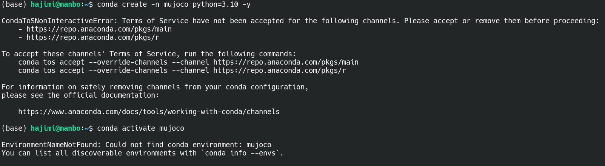
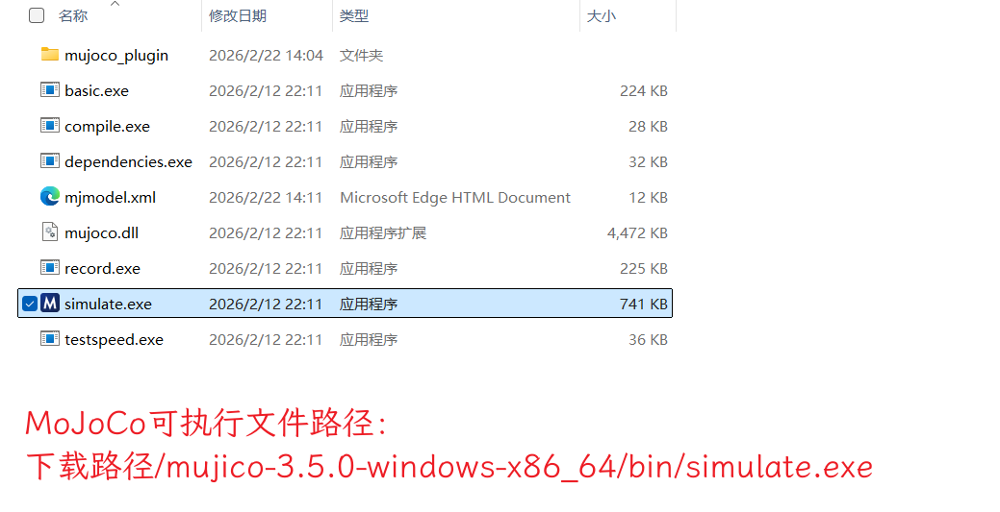
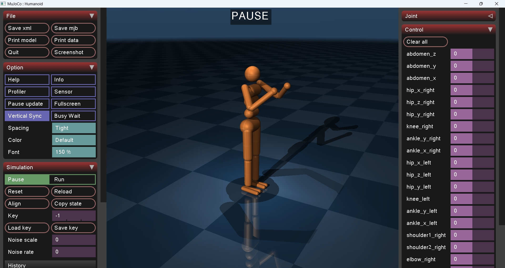
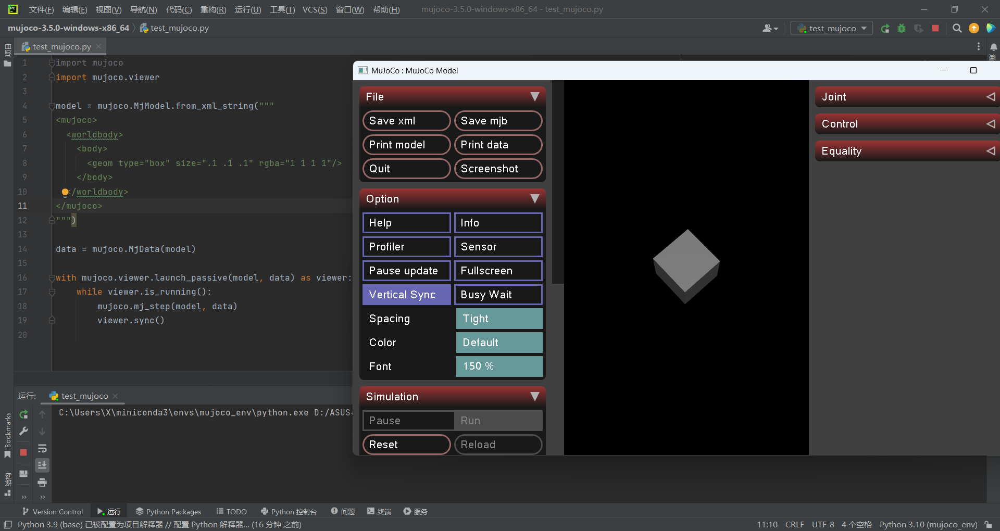

# 安装指南
本指南旨在帮助不同系统的开发者快速搭建 MuJoCo 虚拟仿真环境，重点针对 Linux (Debian/WSL) 进行了优化。

如果使用强化学习,推荐安装如下pip包
```shell
# 提供强化学习(RL)的标准化环境接口
pip install gymnasium

# 录制视频或制作 GIF 动图
pip install imageio

# 处理庞大的矩阵和数组数学运算
pip install numpy

# 深度学习框架
pip install torch  
```


## Linux 安装 (Debian/WSL)

1. 安装miniconda

打开 Linux 系统终端，依次运行以下命令进行静默安装：

```shell
# 1. 创建 miniconda 安装文件夹
mkdir -p ~/miniconda3

# 2. 从官方源下载最新的 Linux 安装包 (大概 140MB，稍微等进度条跑完)
wget https://repo.anaconda.com/miniconda/Miniconda3-latest-Linux-x86_64.sh -O ~/miniconda3/miniconda.sh

# 3. 执行静默安装 (-b 代表后台静默，-u 代表更新，-p 指定绝对路径)
bash ~/miniconda3/miniconda.sh -b -u -p ~/miniconda3

# 4. 安装完后，把刚才下载的安装包删掉，节约空间！(可选)
rm ~/miniconda3/miniconda.sh

# 5. 初始化 conda，让你的终端认识 conda 命令
~/miniconda3/bin/conda init bash
```

2. 激活并初始化 Conda

为了让刚才的配置立刻生效，需要**刷新当前终端**

```
source ~/.bashrc
```

验证成功标志：终端命令行最左边出现 **(base)** 前缀！


3. 接受协议与创建Python环境

**重要提示**：由于新版 Conda 的合规要求，第一次下载包前需要接受服务条款，否则会触发报错。



请执行以下命令接受 Anaconda 官方服务条款

```shell
conda tos accept
```


创建一个独立的 Python 3.10 环境：

```shell
# 创建一个名叫 mujoco_env 的环境，并指定 python 版本为 3.10
conda create -n mujoco_env python=3.10 -y
```


4. 激活环境

```shell
# 激活进入专属环境
conda activate mujoco_env
```

5. 安装 MuJoCo

```shell
# 安装 MuJoCo 引擎
pip install mujoco
```

6. 代码测试

创建 test_mujoco.py 文件
```python
import mujoco
import mujoco.viewer

model = mujoco.MjModel.from_xml_string("""
<mujoco>
  <worldbody>
    <body>
      <geom type="box" size=".1 .1 .1" rgba="1 0 0 1"/>
    </body>
  </worldbody>
</mujoco>
""")

data = mujoco.MjData(model)

with mujoco.viewer.launch_passive(model, data) as viewer:
    while viewer.is_running():
        mujoco.mj_step(model, data)
        viewer.sync()
```

7. 通过python运行

```shell
python test_mujoco.py
```

8. 若弹出包含红色方块的 3D 软件窗口，则表示安装成功


**温馨提示**：建议第4步下载速度慢，可配置清华镜像源：

```shell
pip config set global.index-url https://pypi.tuna.tsinghua.edu.cn/simple
```


## Macos 安装

1. 安装miniconda

要安装miniconda，请按照官方[安装指南](https://docs.anaconda.net.cn/miniconda/install/)

2. 创建干净的 Python 环境

```shell
conda create -n mujoco python=3.10
conda activate mujoco
```

3. 安装 MuJoCo

```shell
pip install mujoco
```

4. 用代码测试

创建 test_mujoco.py 文件
```python
import mujoco
import mujoco.viewer

model = mujoco.MjModel.from_xml_string("""
<mujoco>
  <worldbody>
    <body>
      <geom type="sphere" size="0.1"/>
    </body>
  </worldbody>
</mujoco>
""")

data = mujoco.MjData(model)

with mujoco.viewer.launch_passive(model, data) as viewer:
    while viewer.is_running():
        mujoco.mj_step(model, data)
        viewer.sync()
```

5. 通过mjpython运行

```shell
mjpython test_mujoco.py
```

6. 弹出软件窗口为安装成功


## Windows 安装
Windows 用户有两种选择：快速查看或 Python 开发环境（推荐两者都做）

### A. 快速查看 (免配置)

1. 下载并解压 MuJoCo[点击下载MuJoCo 3.5.0 Windows 压缩包](https://github.com/google-deepmind/mujoco/releases/download/3.5.0/mujoco-3.5.0-windows-x86_64.zip)

sha256校验：mujoco-3.5.0-windows-x86_64.zip.sha256
877d0dfbceac3de90a874c41e0f20c568d104e8ca19de955c0482e3b63832519 

2. 解压后双击 `bin/simulate.exe`



3. 双击上图的`simulate.exe`后，会同时打开两个窗口  
**注意：这里的shell窗口不要关闭**（最小化即可）


4. 鼠标拖拽，`mujoco-3.5.0-windows-x86_64/model/humanoid/humanoid.xml` ，下的文件到MuJoCo窗口，即可查看效果



---

### B. 开发环境 (推荐使用PyCharm + Miniconda使用)

1. 安装环境

**安装 Miniconda**：前往 [官方下载](https://docs.anaconda.net.cn/miniconda/install/)

**安装 PyCharm**：前往 [官方下载](https://www.jetbrains.com/pycharm/download/#section=windows)
   
2. **创建环境**：

在Anaconda Powershell Prompt 或 Anaconda Prompt 中执行以下命令：

```shell
conda create -n mujoco_env python=3.10 -y
conda activate mujoco_env
```

3. **安装库**：
    
```shell
pip install mujoco
pip install gymnasium
pip install imageio
```
    
4. **在PyCharm环境下运行代码测试**

创建 test_mujoco.py 文件
```python
import mujoco
import mujoco.viewer

model = mujoco.MjModel.from_xml_string("""
<mujoco>
  <worldbody>
    <body>
      <geom type="box" size=".1 .1 .1" rgba="1 1 1 1"/>
    </body>
  </worldbody>
</mujoco>
""")

data = mujoco.MjData(model)

with mujoco.viewer.launch_passive(model, data) as viewer:
    while viewer.is_running():
        mujoco.mj_step(model, data)
        viewer.sync()
```

5. 在PyCharm环境下运行 `python test_mujoco.py`，弹出软件窗口为安装成功



    